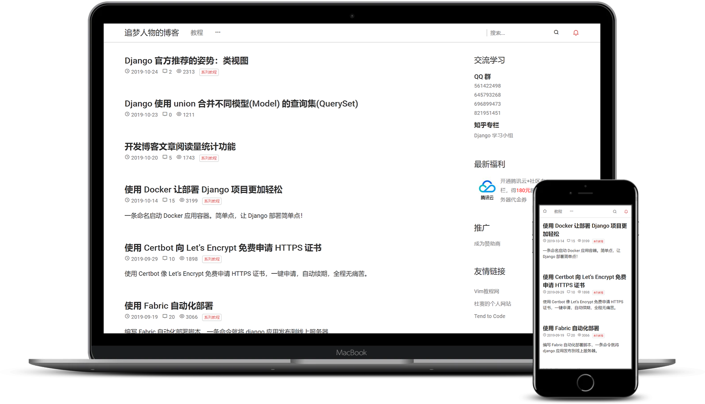

# Django blog project

## 相关资源

[在线预览](https://www.zmrenwu.com/)

## 特性一览

- 简约优雅的 UI，移动端优先的响应式设计。
- Webpack 前端资源打包。
- 基于 Vue 的多级评论系统。
- 文章、评论内容支持 Markdown 与代码高亮。
- 支持 GitHub、新浪微博社交账户登录。
- 中文全文搜索，关键词高亮。
- 完善的通知系统，评论、回复博客内通知，同时邮件提醒。
- 独有的教程系统，方便地管理系列文章。
- Docker 部署，无痛上线。

## 声明
本项目作为开发者的个人博客系统，正在快速地开发和迭代，会引入很多不兼容的改变。目前仅建议将此项目用于学习目的，如需用于生产环境，请等待稳定版 v1.0.0 的发布。
