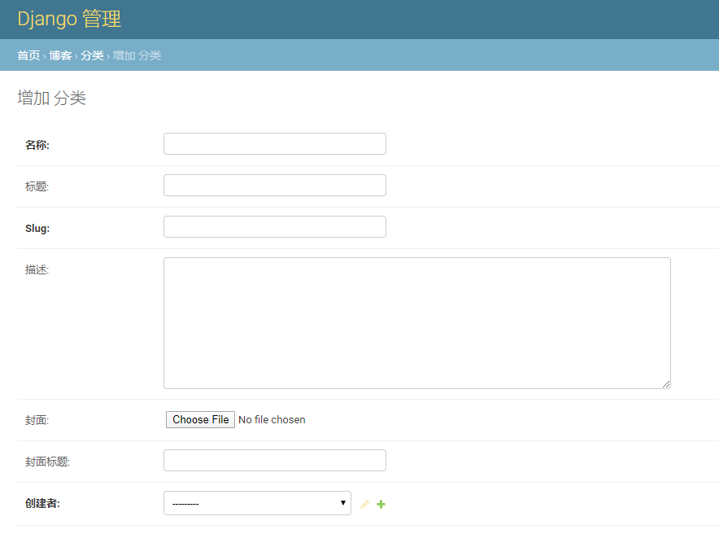
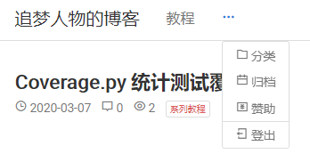

类似于发布博客文章，点击 **博客** 板块下的 **分类** 可进入到已有分类列表。

在分类列表下，点击右上角的 **增加分类** 进入到新增分类页面：

重要字段含义说明如下：

**名称**：分类名

**标题**：同名称

slug：URL 中的 slug，可看作该分类的一个标记，且这个标记会显示在 URL 中以增强可读性，其格式一般是英文单词，使用 - 符号分隔。

例如有一个分类叫做 Django ORM 高级操作，那可以将它的 slug 设置为 django-advanced-orm，则这个分类对应的 URL 就是 /category/django-advanced-orm/，访问这个 URL 将看到该分类下的文章列表。

通过博客导航条中的分类导航可进入分类列表页面：

