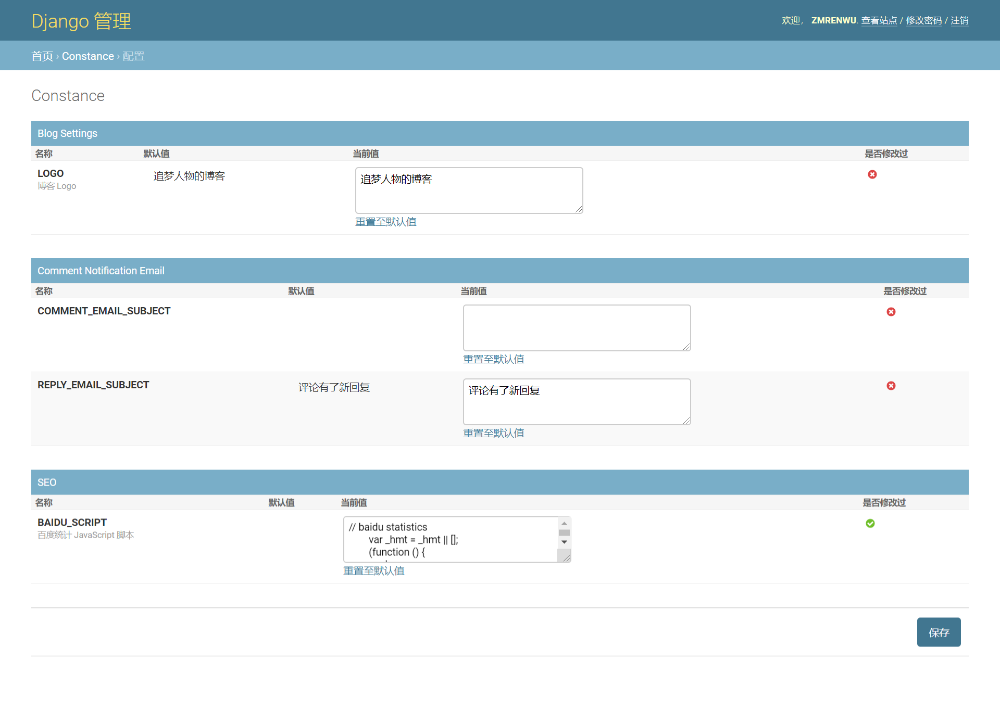

可以通过后台对博客系统进行个性化定制。

点击 **配置**，进入到博客个性化定制页面：

目前支持的个性化配置有：

**LOGO**

默认值：追梦人物的博客

这个配置项用于配置博客导航条显示的 LOGO 文字，下图中红色方框标出的部分。

**COMMENT_EMAIL_SUBJECT**

当用户在博客发表评论后，管理员会收到新评论的邮件提醒。

这个配置项用于配置新评论提醒的邮件标题。

**REPLY_EMAIL_SUBJECT**

博客支持多级评论。当用户在博客中**回复他人评论后**，除了管理员会收到新评论的邮件提醒外，被回复者也会收到邮件提醒。

这个配置项用于配置被回复提醒的邮件标题。

**BAIDU_SCRIPT**

百度统计和百度站长工具的 JavaScript 脚本，主要用于搜索引擎优化。不需要的话可以不用配置。

