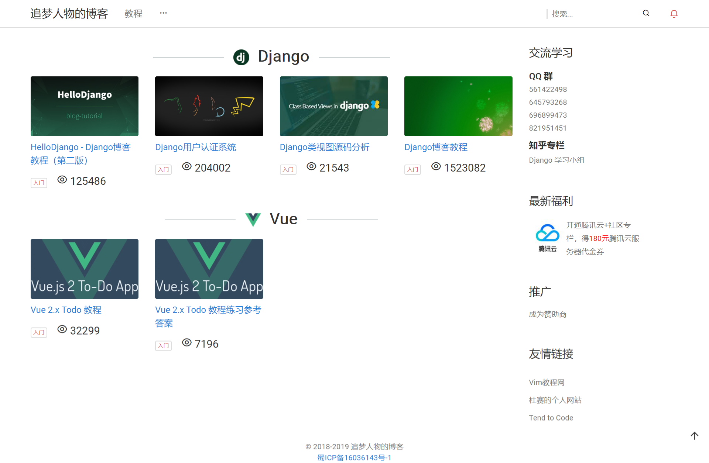
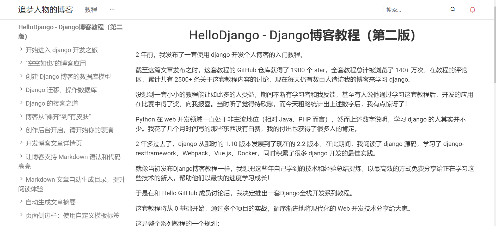
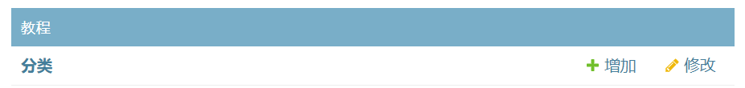
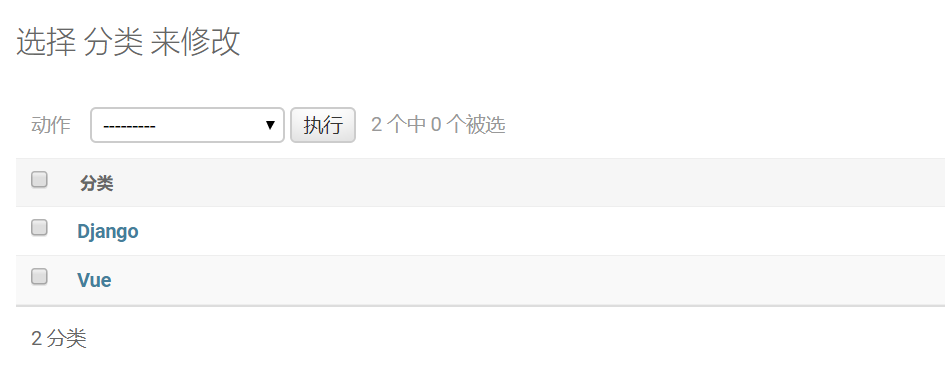
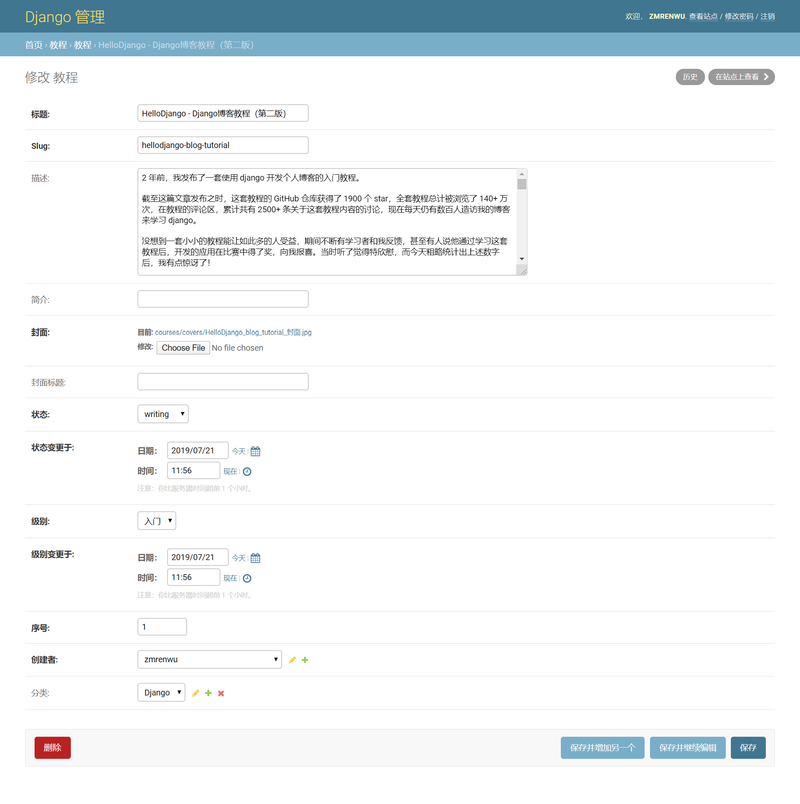
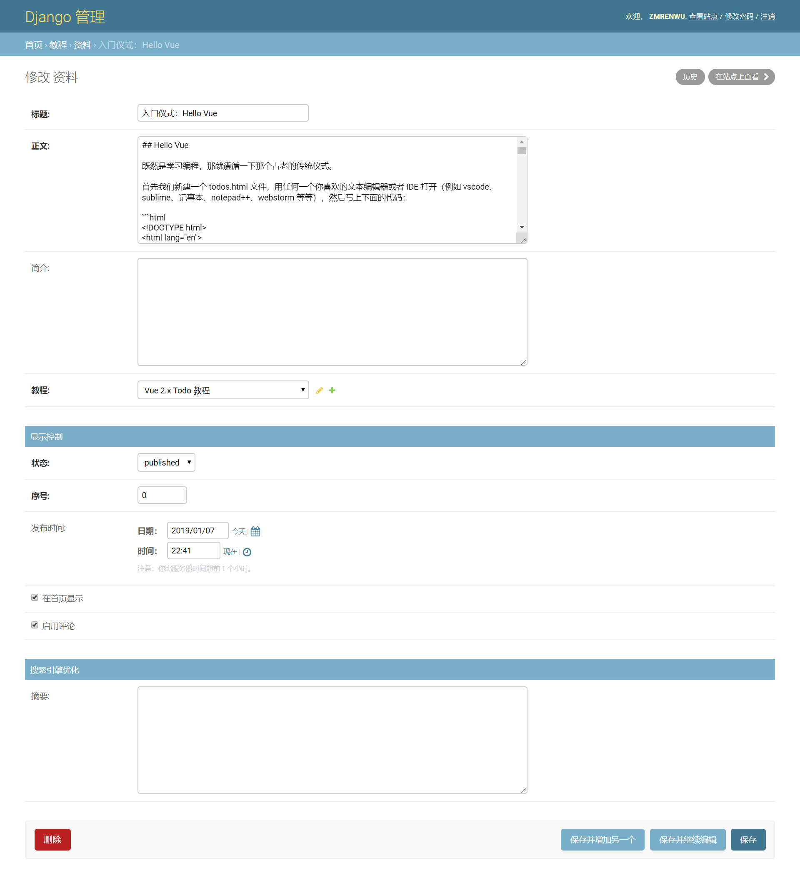

博客包含一套教程系统，其设计初衷是方便组织成体系的博客文章，例如 xxx 入门教程 x 篇，类似于 GitBook。

博客中的全部教程会在教程列表页展示：

教程中的文章会以文档集合的形式展示，左边是目录，右边是内容，方便成体系地阅读。

## 添加教程分类

在博客后台 **教程** 板块的 **分类** 下可以添加教程的分类：

分类主要用于组织不同主题的教程。例如第一张图展示的教程列表页面，可以看到 2 个分类：django 和 Vue，这是因为在后台录入了 django 和 Vue 的分类。

## 添加教程

成体系的博客文章由一个教程来组织。

在博客后台 **教程** 板块的 **教程** 下可以添加教程。

各关键字段的含义说明如下：

slug：和博客文章分类中 slug 的含义一样

描述：对教程的总体描述，用户点击某个教程后首先展示的就是描述的内容，描述支持 Markdown 语法。

简介：主要用于 SEO。

封面：教程展示的封面

状态：writing 和 finished，分别表示正在书写中和已完成

级别：教程的难度级别。

序号：教程列表展示的排序，数字越小越靠前。

分类：教程的分类。

## 添加教程类文章

在博客后台 **教程** 板块的 **资料** 下可以添加教程类文章。

