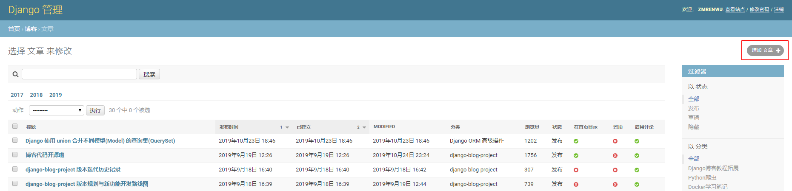
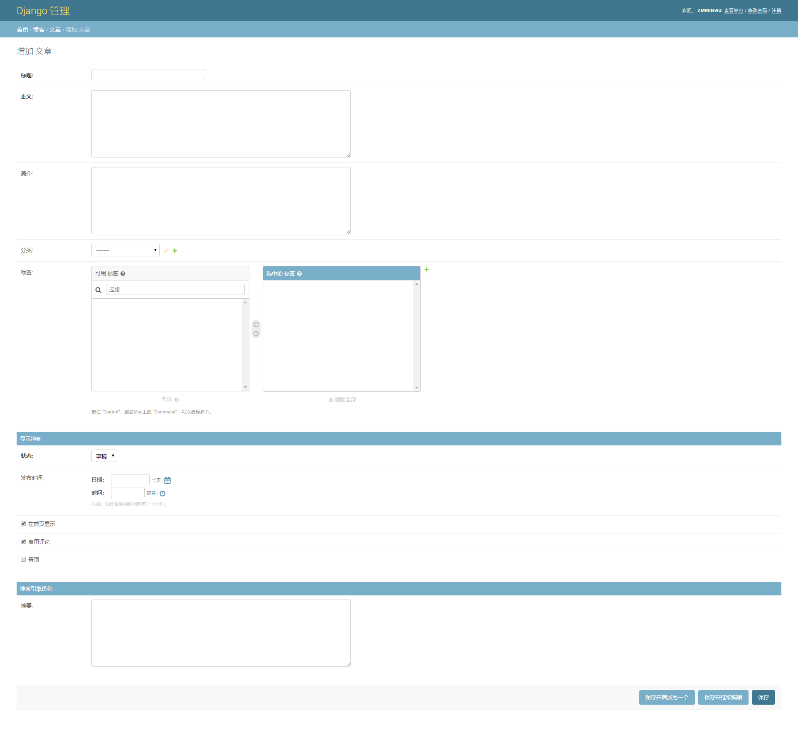
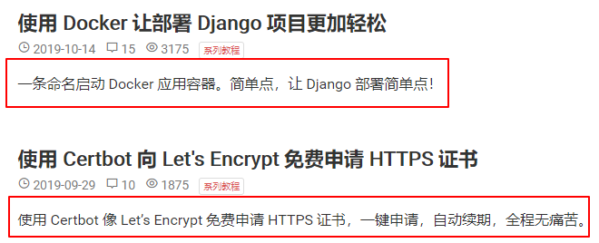

博客最核心的功能就是发表博客文章。

点击 **博客** 板块下的 **文章**，将进入到已发布的博客文章列表页面：

点击右上角红色方框标出的 **增加文章** 按钮，进入到文章发布页面：

各输入项说明如下：

**标题**：博客文章的标题

**正文**：博客文章的内容

**简介**：博客文章简介，类似于摘要，可填可不填，如果填写的话，博客文章列表会显示填写的摘要内容，图中红色方框部分就是简介内容。

**分类**：文章分类，如何添加分类详见 [添加文章分类](category.md)

**标签**：文章标签，如何添加标签详见 [标签](tag.md)

**状态**：文章状态，用于控制文章的显示，有以下三种状态

- 草稿：草稿状态的文章不会在博客首页的文章列表显示，且无法被搜索到
- 隐藏：隐藏状态的文章不会在博客首页的文章列表显示，但可以被搜索到
- 发布：正常发布的文章，会在博客首页的文章列表显示。

**发布时间**：文章发布的时间，可以选择一个比当前时间更晚的时间，达到定时发布的效果。

**在首页显示**：是否显示在博客首页的文章列表中。但无论是否显示，都可以被搜索到。

**启用评论**：允许评论。

**置顶**：置顶的文章会显示在博客首页的文章列表的最前面。

**摘要**：类似于简介，主要用于搜索引擎优化，对内容的展示没有影响。

内容填写完成后点击 **保存** 就可以发布文章了。

此外，对于已发布的文章，在后台的文章列表页点击文章标题可进入文章编辑页面，你可以对文章内容进行修改，修改完后别忘了点击 **保存**。